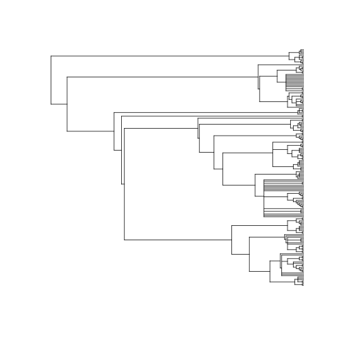

branching
=======


R client to fetch phylogenies from many places

To be included, with the associated function prefix:

* [Phylomatic](http://phylodiversity.net/phylomatic/) - `phylomatic`
* [Open Tree of Life](http://blog.opentreeoflife.org/) - `tol`

## Installation


```r
install.packages("devtools")
devtools::install_github("ropensci/branching")
```


```r
library("branching")
```

## Phylomatic


```r
taxa <- c("Poa annua", "Phlox diffusa", "Helianthus annuus")
tree <- phylomatic(taxa=taxa, get = 'POST')
plot(tree, no.margin=TRUE)
```

 

You can pass in up to about 5000 names. We can use `taxize` to get a random set of plant species names. 


```r
library("taxize")
spp <- names_list("species", 200)
out <- phylomatic(taxa = spp, get = "POST")
plot(out, show.tip.label = FALSE)
```

 

## Open Tree of Life


```r
taxa <- c("Poa annua", "Phlox diffusa", "Helianthus annuus")
tree <- tol(taxa)
plot(tree, no.margin=TRUE)
```

 

## Meta

* [Please report any issues or bugs](https://github.com/ropensci/branching/issues).
* License: MIT
* Get citation information for `branching` in R doing `citation(package = 'branching')`

[](http://ropensci.org)
